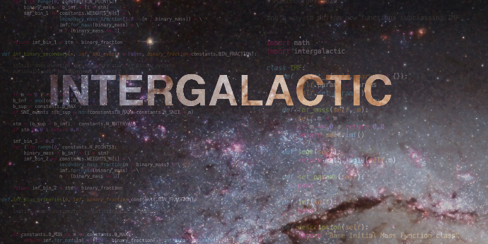

==========
Starmatrix
==========

**Modelling nucleosynthesis of galactic chemical elements**

Starmatrix is a Q-Matrix generator.

Based on explicit values for *solar abundances*, *Z* and *IMF*, Starmatrix calculates matrices ``Q(i,j)`` of masses of elements ``i`` ejected to the galactic medium as element ``j``, for a complete range of stellar masses, accounting for supernovae of types *I* and *II*.

A technique based on the *Q-matrix formalism* (*Talbot & Arnett, 1973*; *Ferrini et al., 1992*; *Portinari et al., 1998*) is used to calculate the elemental abundances.

Starmatrix computes the contribution matrix of 15 elements:

+-+-+---+---+-+---+-+-+--+--+--+-+--+--+
|H|D|He3|He4|C|C13|N|O|Ne|Mg|Si|S|Ca|Fe|
+-+-+---+---+-+---+-+-+--+--+--+-+--+--+

and neutron rich isotopes (referred as ``n.r.`` in the code).

**Codebase**

The code for *Starmatrix* is hosted at `GitHub`_ under a MIT license.

.. _`GitHub`: https://github.com/xuanxu/starmatrix

.. toctree::
   :maxdepth: 2
   :caption: User guide:

   installation
   usage
   configuration
   testing_edge
   credits
