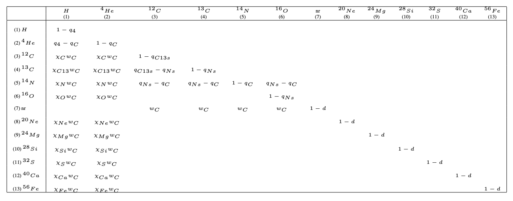

Output Files
============

Runnign Starmatrix produces three text files:

:qm-matrices: The main output file containing Q matrices for each mass interval with the ejections for 15 chemical elements. Expressed as stellar mass fractions.
:mass_intervals: The intervals of mass used for each time step of the integration.
:imf_supernova_rates: The resulting supernovae rates for each mass interval.

Location
--------

The output files are created in the directory specified in the settings file with the ``output_dir`` parameter. If empty or non-present a new ``results`` directory will be created in the working path and the output files will be generated there.

Qm matrices file
----------------

The ``qm-matrices`` file contains all the Q-matrices of elements, one for each of the intervals in the configured mass range.
Each Q-matrix is 15 rows x 9 columns of data, where every entry represents the stellar mass fraction originally in form of the element in the column which has been processed and ejected as the element in the row.

The element production matrix has this structure:

    +---+-+-+---+---+---+---+---+---+--+
    |   |H|D|He3|He4|C12|O16|N14|C13|nr|
    +===+=+=+===+===+===+===+===+===+==+
    |H  |                              |
    +---+------------------------------+
    |D  |                              |
    +---+------------------------------+
    |He3|                              |
    +---+------------------------------+
    |He4|                              |
    +---+------------------------------+
    |C12|                              |
    +---+------------------------------+
    |O16|                              |
    +---+------------------------------+
    |N14|                              |
    +---+------------------------------+
    |C13|                              |
    +---+------------------------------+
    |nr |                              |
    +---+------------------------------+
    |Ne |                              |
    +---+------------------------------+
    |Mg |                              |
    +---+------------------------------+
    |Si |                              |
    +---+------------------------------+
    |S  |                              |
    +---+------------------------------+
    |Ca |                              |
    +---+------------------------------+
    |Fe |                              |
    +---+-+-+---+---+---+---+---+---+--+

So, for example, the data in the 14th row and 4th column is the Calcium created from Helium 4.

By default every matrix has a header line with the corresponding mass interval. This headers can be disabled via the configuration file setting the value for ``matrix_headers`` to `false`.

Example of a qm-matrices output file (truncated)::

    # Q matrix for mass interval: [40.0, 38.6169292113]
    0.0004294859   -0.0004052298    0.0000000000    0.0000000000    0.0000000000    0.0000000000    0.0000000000    0.0000000000    0.0000000000
    0.0000000000    0.0000000000    0.0000000000    0.0000000000    0.0000000000    0.0000000000    0.0000000000    0.0000000000    0.0000000000
    0.0000000000    0.0003300456    0.0002200304    0.0000000000    0.0000000000    0.0000000000    0.0000000000    0.0000000000    0.0000000000
    0.0001488990    0.0005375317    0.0003583545    0.0005783849    0.0000000000    0.0000000000    0.0000000000    0.0000000000    0.0000000000
    0.0000249375    0.0000374063    0.0000249375    0.0000249375    0.0004088744    0.0000000000    0.0000000000    0.0000000000    0.0000000000
    0.0001378250    0.0002067375    0.0001378250    0.0001378250    0.0000000000    0.0004209163    0.0000000000    0.0000000000    0.0000000000
    0.0000000026    0.0000000039    0.0000000026    0.0000000026    0.0001574686    0.0001574686    0.0005783849    0.0001574686    0.0000000000
    0.0000000044    0.0000000067    0.0000000044    0.0000000044    0.0000120419    0.0000000000    0.0000000000    0.0004209163    0.0000000000
    0.0000000000    0.0000000000    0.0000000000    0.0000000000    0.0002320747    0.0002320747    0.0002320747    0.0002320747    0.0008104596
    0.0000269545    0.0000404318    0.0000269545    0.0000269545    0.0000000000    0.0000000000    0.0000000000    0.0000000000    0.0000000000
    0.0000031806    0.0000047709    0.0000031806    0.0000031806    0.0000000000    0.0000000000    0.0000000000    0.0000000000    0.0000000000
    0.0000070027    0.0000105041    0.0000070027    0.0000070027    0.0000000000    0.0000000000    0.0000000000    0.0000000000    0.0000000000
    0.0000033363    0.0000050044    0.0000033363    0.0000033363    0.0000000000    0.0000000000    0.0000000000    0.0000000000    0.0000000000
    0.0000004043    0.0000006064    0.0000004043    0.0000004043    0.0000000000    0.0000000000    0.0000000000    0.0000000000    0.0000000000
    0.0000013583    0.0000020375    0.0000013583    0.0000013583    0.0000000000    0.0000000000    0.0000000000    0.0000000000    0.0000000000
    # Q matrix for mass interval: [38.6169292113, 37.3257894555]
    0.0004287608   -0.0004004904    0.0000000000    0.0000000000    0.0000000000    0.0000000000    0.0000000000    0.0000000000    0.0000000000
    0.0000000000    0.0000000000    0.0000000000    0.0000000000    0.0000000000    0.0000000000    0.0000000000    0.0000000000    0.0000000000
    0.0000000000    0.0003316710    0.0002211140    0.0000000000    0.0000000000    0.0000000000    0.0000000000    0.0000000000    0.0000000000
    0.0001477359    0.0005330740    0.0003553827    0.0005764967    0.0000000000    0.0000000000    0.0000000000    0.0000000000    0.0000000000
    0.0000238159    0.0000357239    0.0000238159    0.0000238159    0.0004096646    0.0000000000    0.0000000000    0.0000000000    0.0000000000
    0.0001332491    0.0001998736    0.0001332491    0.0001332491    0.0000000000    0.0004216718    0.0000000000    0.0000000000    0.0000000000
    0.0000000027    0.0000000040    0.0000000027    0.0000000027    0.0001548248    0.0001548248    0.0005764967    0.0001548248    0.0000000000
    0.0000000042    0.0000000064    0.0000000042    0.0000000042    0.0000120073    0.0000000000    0.0000000000    0.0004216718    0.0000000000
    0.0000000000    0.0000000000    0.0000000000    0.0000000000    0.0002244840    0.0002244840    0.0002244840    0.0002244840    0.0008009807
    0.0000277443    0.0000416164    0.0000277443    0.0000277443    0.0000000000    0.0000000000    0.0000000000    0.0000000000    0.0000000000
    0.0000033832    0.0000050747    0.0000033832    0.0000033832    0.0000000000    0.0000000000    0.0000000000    0.0000000000    0.0000000000
    0.0000066766    0.0000100149    0.0000066766    0.0000066766    0.0000000000    0.0000000000    0.0000000000    0.0000000000    0.0000000000
    0.0000031411    0.0000047116    0.0000031411    0.0000031411    0.0000000000    0.0000000000    0.0000000000    0.0000000000    0.0000000000
    0.0000003807    0.0000005711    0.0000003807    0.0000003807    0.0000000000    0.0000000000    0.0000000000    0.0000000000    0.0000000000
    0.0000014330    0.0000021495    0.0000014330    0.0000014330    0.0000000000    0.0000000000    0.0000000000    0.0000000000    0.0000000000
    # Q matrix for mass interval: [37.3257894555, 36.1164668594]
    0.0004286109   -0.0003963591    0.0000000000    0.0000000000    0.0000000000    0.0000000000    0.0000000000    0.0000000000    0.0000000000
    0.0000000000    0.0000000000    0.0000000000    0.0000000000    0.0000000000    0.0000000000    0.0000000000    0.0000000000    0.0000000000
    0.0000000000    0.0003333835    0.0002222556    0.0000000000    0.0000000000    0.0000000000    0.0000000000    0.0000000000    0.0000000000
    0.0001467870    0.0005297134    0.0003531423    0.0005753979    0.0000000000    0.0000000000    0.0000000000    0.0000000000    0.0000000000
    0.0000227451    0.0000341176    0.0000227451    0.0000227451    0.0004109786    0.0000000000    0.0000000000    0.0000000000    0.0000000000
    0.0001289278    0.0001933917    0.0001289278    0.0001289278    0.0000000000    0.0004229675    0.0000000000    0.0000000000    0.0000000000
    0.0000000027    0.0000000041    0.0000000027    0.0000000027    0.0001524304    0.0001524304    0.0005753979    0.0001524304    0.0000000000
    0.0000000040    0.0000000061    0.0000000040    0.0000000040    0.0000119890    0.0000000000    0.0000000000    0.0004229675    0.0000000000
    0.0000000000    0.0000000000    0.0000000000    0.0000000000    0.0002173203    0.0002173203    0.0002173203    0.0002173203    0.0007927182
    0.0000285566    0.0000428349    0.0000285566    0.0000285566    0.0000000000    0.0000000000    0.0000000000    0.0000000000    0.0000000000
    0.0000035866    0.0000053799    0.0000035866    0.0000035866    0.0000000000    0.0000000000    0.0000000000    0.0000000000    0.0000000000
    0.0000063649    0.0000095474    0.0000063649    0.0000063649    0.0000000000    0.0000000000    0.0000000000    0.0000000000    0.0000000000
    0.0000029534    0.0000044302    0.0000029534    0.0000029534    0.0000000000    0.0000000000    0.0000000000    0.0000000000    0.0000000000
    0.0000003581    0.0000005371    0.0000003581    0.0000003581    0.0000000000    0.0000000000    0.0000000000    0.0000000000    0.0000000000
    0.0000015083    0.0000022624    0.0000015083    0.0000015083    0.0000000000    0.0000000000    0.0000000000    0.0000000000    0.0000000000
    # Q matrix for mass interval: [36.1164668594, 34.980431972]
    ...

For a more detailed explanation on the Q-Matrix formalism see  `Ferrini et al. (1992)`_ and `Portinari et al. Astron. Astrophys. 334, 505-539 (1998)`_.

.. _`Ferrini et al. (1992)`: https: //doi.org/10.1086/171066

.. _`Portinari et al. Astron. Astrophys. 334, 505-539 (1998)`: http://aa.springer.de/papers/8334002/2300505/small.htm

Mass intervals file
-------------------

Starmatrix also produces a ``mass_intervals`` file where all the intervals of mass used for the integration and the generation of matrices are listed.

The structure of the file is as follows:

 - A first row that contains:
     - the initial time for the integration (corresponding with the lifetime of the more massive star for the given metallicity)
     - the finish time for the integration
     - the total steps used
     - the delta for the time steps
 - The rest of the rows list the mass intervals used and have three entries:
     - the upper limit of the mass interval
     - the lower limit of the mass interval
     - a counter numbering each interval

Example of a mass_intervals output file (truncated)::

    0.004647378838923375 10.197573456196142 300 0.011137629220618409
     40.0000000000   38.6169292113  1
     38.6169292113   37.3257894555  2
     37.3257894555   36.1164668594  3
     36.1164668594   34.9804319720  4
     34.9804319720   33.9104208272  5
     33.9104208272   32.9001933247  6
     32.9001933247   31.9443472846  7
     31.9443472846   31.0381733309  8
     31.0381733309   30.1775402085  9
     30.1775402085   29.3588031220  10
     29.3588031220   28.5787297184  11
     28.5787297184   27.8344397595  12
     27.8344397595   27.1233555290  13
     27.1233555290   26.4431607448  14
     26.4431607448   25.7917662712  15
     25.7917662712   25.1672813142  16
     25.1672813142   24.5679890732  17
     24.5679890732   23.9923260413  18
     23.9923260413   23.4388643126  19
     23.4388643126   22.9062963837  20
     22.9062963837   22.3934220376  21
     22.3934220376   21.8991369736  22
     21.8991369736   21.4224229101  23
     21.4224229101   20.9623389372  24
     20.9623389372   20.5180139313  25
     20.5180139313   20.0886398802  26
     20.0886398802   19.6734659889  27
     ...

Supernova rates file
--------------------

The last output generated when running Starmatrix is the ``imf_supernova_rates`` file. It is a text file with as many lines as mass intervals (i.e. integration steps) and with four columns (4 entries per line):

    - The value of the initial mass funtion for the corresponding mass
    - The supernova type I rate obtained for the interval
    - The supernova type II rate obtained for the interval
    - The total (thermal and kinetic) energy released by supernovae for the corresponding mass interval

Example of a imf_supernova_rates output file (truncated)::

    0.0008567779  0.0000000000  0.0000218023  0.0003484982
    0.0008482838  0.0000000000  0.0000223459  0.0003416759
    0.0008410511  0.0000000000  0.0000229093  0.0003349845
    0.0008348889  0.0000000000  0.0000234913  0.0003284215
    0.0008296447  0.0000000000  0.0000240910  0.0003219844
    0.0008251942  0.0000000000  0.0000247076  0.0003156711
    0.0008214358  0.0000000000  0.0000253405  0.0003094791
    0.0008182850  0.0000000000  0.0000259894  0.0003034063
    0.0008156711  0.0000000000  0.0000266538  0.0002974504
    0.0008135345  0.0000000000  0.0000273337  0.0002916091
    0.0008118243  0.0000000000  0.0000280287  0.0002858805
    0.0008104971  0.0000000000  0.0000287388  0.0002802624
    0.0008095155  0.0000000000  0.0000294640  0.0002747526
    0.0008088470  0.0000000000  0.0000302041  0.0002693493
    0.0008084634  0.0000000000  0.0000309592  0.0002640503
    0.0008083398  0.0000000000  0.0000317294  0.0002588538
    0.0008084545  0.0000000000  0.0000325146  0.0002537577
    0.0008087882  0.0000000000  0.0000333149  0.0002487603
    0.0008093238  0.0000000000  0.0000341304  0.0002438597
    0.0008100461  0.0000000000  0.0000349613  0.0002390540
    0.0008109415  0.0000000000  0.0000358075  0.0002343415
    0.0008119978  0.0000000000  0.0000366693  0.0002297203
    0.0008132041  0.0000000000  0.0000375468  0.0002251888
    0.0008145505  0.0000000000  0.0000384401  0.0002207453
    0.0008160280  0.0000000000  0.0000393493  0.0002163881
    0.0008176285  0.0000000000  0.0000402747  0.0002121156
    0.0008193447  0.0000000000  0.0000412164  0.0002079262
    0.0008211698  0.0000000000  0.0000421745  0.0002038182
    0.0008230977  0.0000000000  0.0000431492  0.0001997903
    0.0008251229  0.0000000000  0.0000441408  0.0001958407
    0.0008272401  0.0000000000  0.0000451494  0.0001919681
    ...

